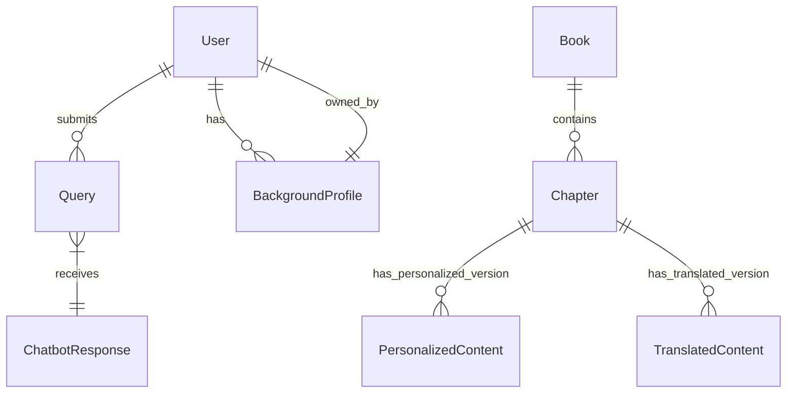

# Data Model: Embodied Intelligence Book

## Entities

### User
Represents a reader of the book, authenticated via `Better-Auth`. Users can have personalized settings and interact with the chatbot.

-   **User ID**: Unique identifier (Primary Key).
-   **Email**: User's email address, used for authentication (Unique).
-   **PasswordHash**: Hashed password for secure authentication.
-   **BackgroundProfileID**: Foreign Key to `BackgroundProfile` (Optional, Nullable).

**Relationships**:
-   `User` has one `BackgroundProfile`.
-   `User` can submit multiple `Queries`.

### Chapter
A distinct section of the Docusaurus book, containing educational content. Chapters can be presented in an original, personalized, or translated format.

-   **Chapter ID**: Unique identifier (Primary Key).
-   **Book ID**: Foreign Key to `Book`.
-   **Title**: Title of the chapter.
-   **OriginalContent**: The raw, untranslated, unpersonalized MDX content of the chapter.

**Relationships**:
-   `Chapter` belongs to one `Book`.
-   `Chapter` content can be personalized based on `BackgroundProfile`.
-   `Chapter` content can be translated.

### Query
A natural language question submitted by a user to the RAG chatbot.

-   **Query ID**: Unique identifier (Primary Key).
-   **UserID**: Foreign Key to `User`.
-   **Timestamp**: Date and time when the query was submitted.
-   **QueryText**: The actual text of the user's question.

**Relationships**:
-   `Query` is submitted by a `User`.
-   `Query` can have one `ChatbotResponse`.

### ChatbotResponse
The answer generated by the RAG chatbot in response to a user's query.

-   **Response ID**: Unique identifier (Primary Key).
-   **Query ID**: Foreign Key to `Query`.
-   **Timestamp**: Date and time when the response was generated.
-   **ResponseText**: The text content of the chatbot's answer.
-   **SourceReferences**: (Optional) List of sections/pages from the book used to generate the response.

**Relationships**:
-   `ChatbotResponse` is a response to a `Query`.

### PersonalizedContent
Stores the personalized version of a chapter for a specific user background.

-   **PersonalizedContent ID**: Unique identifier (Primary Key).
-   **Chapter ID**: Foreign Key to `Chapter`.
-   **BackgroundProfileID**: Foreign Key to `BackgroundProfile`.
-   **PersonalizedText**: The chapter content adapted for the specific background.

**Relationships**:
-   `PersonalizedContent` is a personalized version of a `Chapter` for a `BackgroundProfile`.

### TranslatedContent
Stores the translated version of a chapter for a specific language.

-   **TranslatedContent ID**: Unique identifier (Primary Key).
-   **Chapter ID**: Foreign Key to `Chapter`.
-   **LanguageCode**: Language of translation (e.g., 'ur' for Urdu).
-   **TranslatedText**: The chapter content translated into the target language.

**Relationships**:
-   `TranslatedContent` is a translated version of a `Chapter` into a specific `Language`.

### BackgroundProfile
A data structure storing a user's technical experience and preferences, used by the `Background_Personalizer_Agent`.

-   **Profile ID**: Unique identifier (Primary Key).
-   **UserID**: Foreign Key to `User`.
-   **SoftwareExperience**: JSON or text describing software proficiency (e.g., `{'C++': 'Low', 'Python': 'High', 'ROS': 'Intermediate'}`).
-   **HardwareExperience**: JSON or text describing hardware proficiency (e.g., `{'NVIDIA Jetson': 'Intermediate', 'Arduino': 'Basic'}`).
-   **LearningStyle**: (Optional) User's preferred learning style (e.g., 'Visual', 'Practical').

**Relationships**:
-   `BackgroundProfile` belongs to one `User`.

### Book
The overarching container for all chapters.

-   **Book ID**: Unique identifier (Primary Key).
-   **Title**: Title of the book.
-   **Description**: Short description of the book.

**Relationships**:
-   `Book` contains multiple `Chapters`.

## Relationships Diagram (Conceptual)

