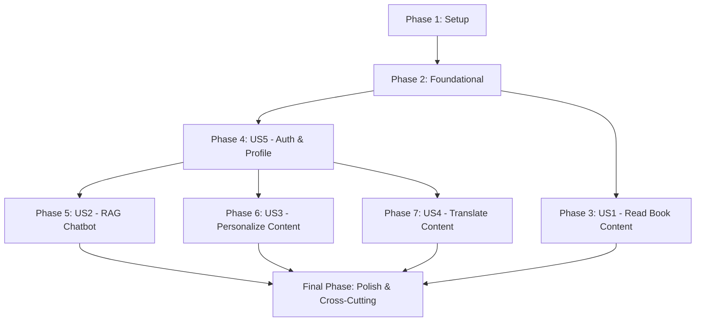

# Tasks for Embodied Intelligence: A Guide to Physical AI & Humanoid Robotics

**Feature Name**: Embodied Intelligence: A Guide to Physical AI & Humanoid Robotics
**Feature Branch**: `001-physical-ai-book`
**Spec**: [specs/001-physical-ai-book/spec.md](specs/001-physical-ai-book/spec.md)
**Plan**: [specs/001-physical-ai-book/plan.md](specs/001-physical-ai-book/plan.md)

This document outlines the tasks required to implement the "Embodied Intelligence: A Guide to Physical AI & Humanoid Robotics" project. Tasks are organized into phases, with User Story phases ordered by priority and dependencies.

## Overall Implementation Strategy

The implementation will follow an iterative approach, prioritizing core functionalities first (User Stories P1) and then integrating advanced features (P2, P3). Dependencies are managed by ensuring foundational services are in place before user-facing features are built. MVP will encompass User Story 1 (Read Book Content) and User Story 5 (Basic Authentication).

## Phase 1: Setup

This phase focuses on initializing the Docusaurus project and setting up the basic repository structure.

### Story Goal
Establish the foundational Docusaurus environment for the book content.

### Independent Test Criteria
The Docusaurus project is initialized, dependencies are installed, and the development server can run without errors.

### Implementation Tasks

- [X] T001 Initialize Docusaurus project in `physical-ai-textbook/`
- [X] T002 Install Docusaurus dependencies in `physical-ai-textbook/`
- [X] T003 Configure basic Docusaurus settings (title, tagline, URL) in `physical-ai-textbook/docusaurus.config.js`

## Phase 2: Foundational

This phase establishes the core infrastructure components that other user stories will depend on, including the FastAPI backend, database (Neon, Qdrant), and agent directories.

### Story Goal
Set up the backend services and infrastructure that will support the interactive features of the book.

### Independent Test Criteria
Basic FastAPI application can run, Python dependencies are installed, and placeholders for database connections are in place. Agent directories are created.

### Implementation Tasks

- [X] T004 Create `backend/` directory for FastAPI project
- [X] T005 Initialize FastAPI project structure within `backend/` (e.g., `app/`, `main.py`)
- [X] T006 Install Python dependencies for FastAPI (e.g., `fastapi`, `uvicorn`) in `backend/requirements.txt`
- [X] T007 Create `agents/` directory for subagents
- [X] T008 Create `agents/translator_agent/` directory for `Translator_Agent`
- [X] T009 Create `agents/personalizer_agent/` directory for `Background_Personalizer_Agent`
- [X] T010 Add placeholder configurations for Neon PostgreSQL connection in `backend/app/core/config.py`
- [X] T011 Add placeholder configurations for Qdrant connection in `backend/app/core/config.py`
- [X] T012 Configure `physical-ai-textbook/.github/workflows/deploy_docs.yml` for GitHub Pages deployment.

## Phase 3: User Story 1 - Read Physical AI Book Content [P1]

This phase is about populating the Docusaurus book with the initial chapter content.

### Story Goal
Enable users to access and read all chapters of the Physical AI book.

### Independent Test Criteria
All 11 chapters are present in the Docusaurus `docs/` directory, and their content is rendered correctly when served. (SC-001)

### Implementation Tasks

- [X] T013 [US1] Create all 11 chapter MDX files in `physical-ai-textbook/docs/` as defined in `spec.md` (e.g., `physical-ai-textbook/docs/Chapter 1.mdx`)
- [X] T014 [US1] Populate `physical-ai-textbook/sidebars.js` with correct chapter structure
- [X] T015 [US1] Add initial content (placeholders or basic text) to each chapter MDX file in `physical-ai-textbook/docs/`
- [X] T016 [US1] Verify Docusaurus build process for the book completes without errors or warnings. (SC-006)

## Phase 4: User Story 5 - User Authentication and Profile [P3]

This phase implements user authentication and profile management, which is a prerequisite for personalization.

### Story Goal
Allow users to securely sign up, sign in, and manage their basic profile information, including background details for personalization.

### Independent Test Criteria
Users can register, log in, and update their profile via the API endpoints defined in `openapi.yaml`. (SC-005)

### Implementation Tasks

- [X] T017 [US5] Implement `User` data model in `backend/app/models/user.py` based on `data-model.md`
- [X] T018 [US5] Implement `BackgroundProfile` data model in `backend/app/models/user.py` based on `data-model.md`
- [X] T019 [US5] Integrate `Better-Auth` library for authentication in `backend/app/core/security.py`
- [X] T020 [US5] Implement `/auth/signup` endpoint in `backend/app/api/auth.py`
- [X] T021 [US5] Implement `/auth/signin` endpoint in `backend/app/api/auth.py`
- [X] T022 [US5] Implement `/user/profile` (GET) endpoint in `backend/app/api/user.py`
- [X] T023 [US5] Implement `/user/profile` (PUT) endpoint in `backend/app/api/user.py`
- [X] T024 [US5] Store user background information during signup in Neon Serverless Postgres in `backend/app/db/crud.py`
- [X] T025 [US5] Update user background information in Neon Serverless Postgres in `backend/app/db/crud.py`

## Phase 5: User Story 2 - Interact with RAG Chatbot [P1]

This phase focuses on building the RAG chatbot functionality, including its backend and frontend integration.

### Story Goal
Provide an interactive RAG chatbot that can answer questions based on the book's content.

### Independent Test Criteria
The RAG chatbot responds accurately to book-related queries, handles out-of-scope queries gracefully, and the FastAPI backend meets p95 latency goals. (SC-002, SC-007)

### Implementation Tasks

- [X] T026 [US2] Implement `Query` data model in `backend/app/models/chatbot.py` based on `data-model.md`
- [X] T027 [US2] Implement `ChatbotResponse` data model in `backend/app/models/chatbot.py` based on `data-model.md`
- [X] T028 [US2] Set up vector embedding generation for book content in `backend/app/core/vector_store.py`
- [X] T029 [US2] Implement content ingestion and indexing into Qdrant Cloud Free Tier in `backend/app/db/qdrant_client.py`
- [X] T030 [US2] Implement RAG logic using OpenAI Agents/ChatKit SDKs in `backend/app/core/rag_pipeline.py`
- [X] T031 [US2] Implement `/chatbot/query` endpoint in `backend/app/api/chatbot.py`
- [X] T032 [US2] Create Docusaurus React component for RAG chatbot UI in `physical-ai-textbook/src/components/Chatbot.js`
- [X] T033 [US2] Integrate RAG chatbot component into Docusaurus pages (e.g., `physical-ai-textbook/src/pages/index.js` or a dedicated layout)
- [X] T034 [US2] Ensure RAG chatbot output includes source references if applicable.

## Phase 6: User Story 3 - Personalize Chapter Content [P2]

This phase implements the personalization feature using the `Background_Personalizer_Agent`.

### Story Goal
Allow logged-in users to dynamically personalize chapter content based on their stored background profiles.

### Independent Test Criteria
The `Background_Personalizer_Agent` successfully modifies content based on a user's background, and personalized content is displayed correctly. (SC-003)

### Implementation Tasks

- [X] T035 [US3] Implement `PersonalizedContent` data model in `backend/app/models/personalization.py` based on `data-model.md`
- [X] T036 [US3] Implement `Background_Personalizer_Agent` logic in `agents/personalizer_agent/personalizer.py`
- [X] T037 [US3] Create endpoint to process personalization requests using the agent in `backend/app/api/personalization.py`
- [X] T038 [US3] Implement `/content/personalize` endpoint in `backend/app/api/personalization.py`
- [X] T039 [US3] Create Docusaurus React component for "Personalize Chapter" button in `physical-ai-textbook/src/components/PersonalizationButton.js`
- [X] T040 [US3] Integrate personalization button into chapter layouts in `physical-ai-textbook/src/components/ChapterLayout.js`
- [X] T041 [US3] Display personalized content dynamically in Docusaurus frontend.

## Phase 7: User Story 4 - Translate Chapter Content [P2]

This phase implements the Urdu translation feature using the `Translator_Agent`.

### Story Goal
Enable users to translate chapter content into Urdu for improved accessibility.

### Independent Test Criteria
The `Translator_Agent` provides accurate Urdu translations of book content, and translated content is displayed correctly. (SC-004)

### Implementation Tasks

- [X] T042 [US4] Implement `TranslatedContent` data model in `backend/app/models/translation.py` based on `data-model.md`
- [X] T043 [US4] Implement `Translator_Agent` logic in `agents/translator_agent/translator.py`
- [X] T044 [US4] Create endpoint to process translation requests using the agent in `backend/app/api/translation.py`
- [X] T045 [US4] Implement `/content/translate` endpoint in `backend/app/api/translation.py`
- [X] T046 [US4] Create Docusaurus React component for "Urdu Translation" button in `physical-ai-textbook/src/components/TranslationButton.js`
- [X] T047 [US4] Integrate translation button into chapter layouts in `physical-ai-textbook/src/components/ChapterLayout.js`
- [X] T048 [US4] Display translated content dynamically in Docusaurus frontend.

## Final Phase: Polish & Cross-Cutting Concerns

This phase covers overall project polish, deployment, and final verification.

### Story Goal
Ensure the entire application is robust, performant, and correctly deployed, meeting all success criteria.

### Independent Test Criteria
All functional requirements are met, performance goals are achieved, and the book is successfully deployed and accessible.

### Implementation Tasks

- [X] T049 Implement logging and monitoring for FastAPI backend.
- [X] T050 Conduct end-to-end testing of all user stories.
- [X] T051 Optimize Docusaurus build for production.
- [X] T052 Finalize GitHub Pages deployment configuration for continuous deployment.
- [X] T053 Verify all 11 chapters are accessible and render correctly on GitHub Pages. (SC-001)
- [X] T054 Verify RAG chatbot responds accurately within performance goals. (SC-002, SC-007)
- [X] T055 Verify personalization feature adjusts content correctly. (SC-003)
- [X] T056 Verify Urdu translation feature produces accurate translations. (SC-004)
- [X] T057 Verify user authentication and profile management. (SC-005)

## Dependencies Graph (Conceptual)

## Parallel Execution Opportunities

-   **User Story 1 (Read Book Content)**: While backend and agent development are ongoing, the Docusaurus frontend can be populated with initial chapter content in parallel.
-   **Phase 4 (Auth & Profile)**, **Phase 5 (RAG Chatbot)**, **Phase 6 (Personalization)**, and **Phase 7 (Translation)**: Once the foundational backend is set up (Phase 2), the development of these features can proceed with some level of parallelism, especially if different teams/developers are assigned. However, US5 is a strong prerequisite for US3 and US4, and portions of US2 (Qdrant setup) can run in parallel with US5.
-   **Agent Development**: The `Translator_Agent` and `Background_Personalizer_Agent` can be developed concurrently in their respective `agents/` directories.

## MVP Scope

The Minimum Viable Product (MVP) will focus on delivering:
-   **User Story 1**: Ability to read all book content from the deployed Docusaurus site on GitHub Pages.
-   **User Story 5 (Partial)**: Basic user signup and sign-in functionality (without full profile management initially, if time is constrained).
This MVP ensures the core educational content is available and provides a foundation for future interactive features.
